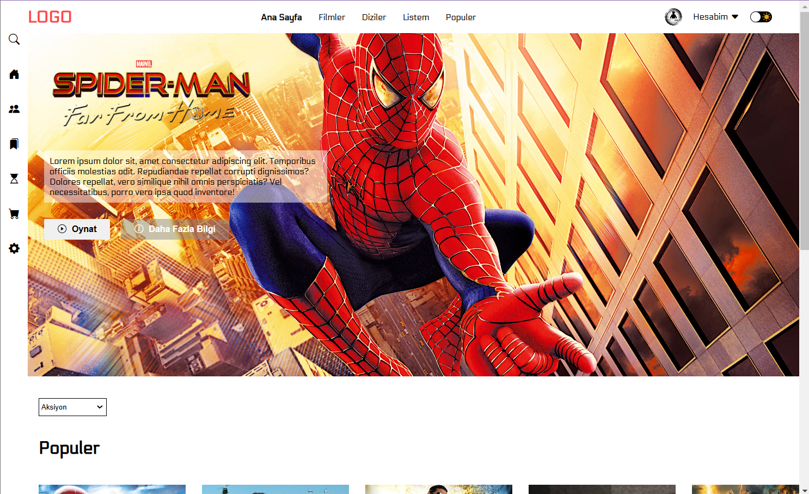
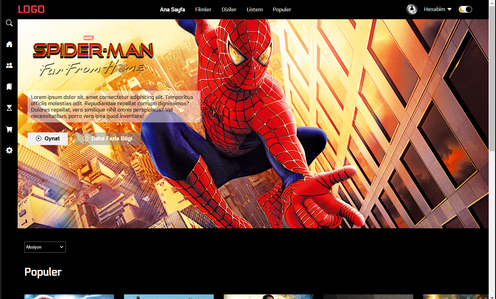
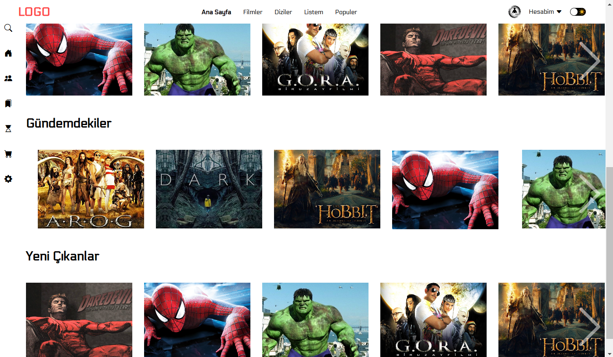

# Movie Website
This is a simple movie website project built using HTML, CSS, and JavaScript. The site features a dark and light mode toggle, a movie list slider, and a category dropdown. It provides an interactive UI to display movie listings with categories like "Popular," "Trending," and "New Releases."

## 📸 Screenshots

## Features
🌗 Light/Dark Mode Toggle: The toggle button in the top right switches between light and dark themes.
🎞️ Movie List Carousel: Users can navigate through movies using the arrow buttons on the left and right sides of each category.
🖱️ Hover Effects: Movies have hover effects that enlarge the image and reveal details.
📱 Responsive Design: Works across different screen sizes.

## 🛠 Technologies Used
HTML 🏗️: Structure of the website
CSS 🎨: Styling and layout
JavaScript 🧩: Interactivity (theme toggle, movie carousel)
Bootstrap Icons ✨: Used for icons
